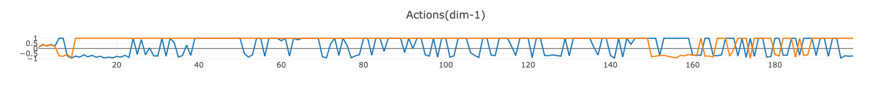

# Collaboration and Competition
To solve Tennis environment, Multi Agent DDPG algorithm is implemented to train two RL agents. 

Both agents have an observation space and continuous action space. Also, each agent has three components:
- An actor-network that uses local observations for deterministic actions
- A target actor-network with identical functionality for training stability
- A critic-network that uses joint states action pairs to estimate Q-values

### Model Architecture

MADDPG algorithm builds upon DDPG algorithm which involves both Actor and Critic. Each agent has four networks and a pair of local and target netwrok for Actor and Critic. In this implementation, local and target network shares the same architecture. The Critic network is trainined on states and actions collected from both agents to reduce the imapct of non-stationary environment to training.

- Actor
  - input: state, dim = 24, continous.
  - two hidden layers with 32 units for each: 
```
Actor(
  (fc1): Linear(in_features=24, out_features=32, bias=True)
  (relu):
  (fc2): Linear(in_features=32, out_features=32, bias=True)
  (relu):
  (fc3): Linear(in_features=32, out_features=2, bias=True)
  (tanh)
)

```
- Critic
  - input from two agentes: state, dim = 2 * 24, continous; action, dim = 2 * 2, continous
  - two hidden layers with 64 units for each:
```
Critic(
  (fcs1): Linear(in_features=48, out_features=64, bias=True)
  (relu):
  (fc2): Linear(in_features=68, out_features=64, bias=True)
  (relu):
  (fc3): Linear(in_features=64, out_features=1, bias=True)
)
```

## Hyper parameters:

|Parameter|Value|Description|
|---------|-----|-----------|
|buffer_size|1e6|Replay memory buffer size|
|batch_size|512|Minibatch size|
|gamma|0.95|Discount factor|
|tau|2e-2|Soft update of target parameters|
|lr_actor|1e-3|Actor learning rate|
|lr_critic|1e-3|Critic learning rate|
|weight_decay|0|L2 weight decay|
|sigma|0.01|Standard deviation of OU Noise std|
|actor_fc1_units|32|Actor network, units for 1st hidden layer|
|actor_fc2_units|32|Actor network, units for 2nd hidden layer|
|critic_fc2_units|64|Critic network, units for 1st hidden layer|
|critic_fcs1_units|64|Critic network, units for 2nd hidden layer|
|update_every|1|How often to learn and update network|


### Training results

- Environment was solved in 1090 episodes with an average score of 0.5013.

<p align="center">

</p>

- Scores 
<p align="center">

</p>

- Losses
<p align="center">


</p>

## Learnings 

- When `reset_parameters` of networks, it is important to reset the `parameters` as well as the `bias`. 

- The values for the loss of Critic and Actor are very small. It is important to clip the gradients for both networks during training. Without this, the actions were stayed constantly at 1 or -1 for both agents which caused the training not to converge. Visdom (Credits to https://github.com/katnoria/unityml-tennis) was used to observe the issue of the predicted actions which ultimately revealed the problem. 

- Smaller network seems to learn better. When training with following hyperparameters with large units for hidden layers, learning was slow comparing to the results above.

Parameter|Value|Description|
|---------|-----|-----------|
|actor_fc1_units|256|Actor network, units for 1st hidden layer|
|actor_fc2_units|256|Actor network, units for 2nd hidden layer|
|critic_fc2_units|512|Critic network, units for 1st hidden layer|
|critic_fcs1_units|512|Critic network, units for 2nd hidden layer|

p3_collab-compet-tennis/runs/
- Average Scores and Raw Scores
<p align="center">


</p>

- Losses
<p align="center">


</p>

- Actions
<p align="center">



</p>
                              
## Future Directions

With the current implementation, the Critic network is trained seperately based on the states/actions from both agents. Create a shared network between these two agents would be interesting experiment to run. 

Futher turning of the hyper parameters for models such as hidden layer size applying these trategies to spend up agent training:

- [Hyperparameter Optimization in Machine Learning Models](https://www.datacamp.com/community/tutorials/parameter-optimization-machine-learning-models)

- [How to optimize Hyperparameters of Machine Learning Models](https://towardsdatascience.com/how-to-optimize-hyperparameters-of-machine-learning-models-98baec703593)

## Appendix

- [Visdom](https://github.com/fossasia/visdom)

